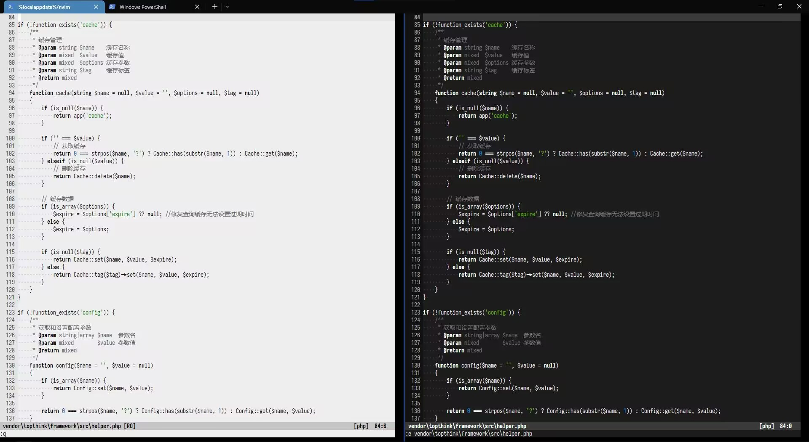

a colorscheme for vim/neovim, only supports the 256 colors terminal, and 
`termguicolors` option enabled. Inspired by [vim-envy][envy] and [saturn.kak][saturn].

[envy]:   https://github.com/kkga/vim-envy
[saturn]: https://github.com/kkga/saturn.kak 
